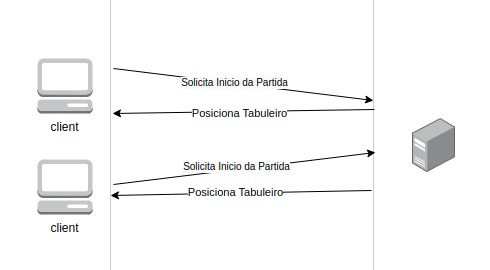
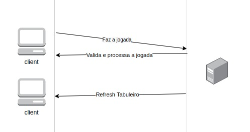
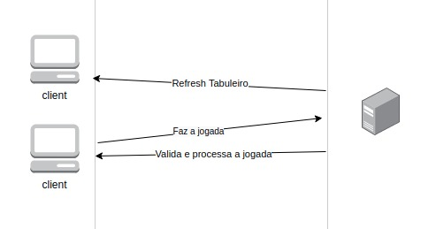

# Documentação

## Índice
* [Arquitetura](#arquitetura)
    * [Tecnologias](#tecnologias)
    * [Diagramas e fluxo](#diagramas-e-fluxo)
* [Interface](#interface)
    * [Programa Cliente](#programa-cliente)
    * [Programa Servidor](#programa-servidor)
    * [Funções do Jogo](#funcoes-do-jogo)
* [Execução](#execucao)


## Arquitetura

Há dois programas: um cliente e um servidor.
O programa servidor é responsável por esperar pela conexão dos clientes (jogadores) e pelo controle da lógica do jogo.
O programa cliente é responsável por se conectar ao servidor, receber informações que devem ser exibidas para o jogador e enviar comandos do jogador para o servidor quando adequado.
Toda a comunicação é realizada através de sockets TCP.

### Tecnologias

- A implementação do cliente será realizada em **Python**
- A implementação do servidor será realizada em **Python**

### Diagramas e fluxo

* **Iniciar partida**: 
    - O jogador solicita uma nova partida.
    - Caso seja o primeiro jogador, este aguarda os demais jogadores conectarem.
    - O sistema distribui as cartas na tela voltadas para baixo.



* **Jogar partida**: 
    - O usuário seleciona a primeira carta e o sistema a exibe na tela.
    - O usuário seleciona a segunda carta e o sistema exibe a mesma na tela.
    - Sistema verifica se as duas cartas selecionadas são iguais. 
    - Sistema contabiliza a jogada efetuada.
    - Caso as cartas sejam iguais, as cartas somem.
    - Caso as cartas não sejam iguais, as cartas voltam a ficar voltadas para baixo.
    - Quando todos os pares de cartas são encontrados o sistema encerra a partida.
    - Sistema exibe a pontuação.
    




* **Sair do jogo**: 
    - Usuário solicita sair do jogo.
    - Sistema finaliza o jogo.


## Interface

### Programa Cliente

Ao ser iniciado, o programa cliente irá abrir uma conexão TCP com o servidor. Após aberta a conexão, o programa cliente recebe do servidor um identificador numérico do seu jogador dentro da partida que se iniciará.


dim: Dimensão do tabuleiro para a partida. Controla a dificuldade do jogo. Pode ser qualquer número par menor que 10.
nJogadores: número de jogadores na partida.
Ao ser executado, o programa gera um tabuleiro quadrado (de dim X dim casas), identificadas por coordenadas (i, j), com 0 <= i, j < dim. Cada casa contém uma carta com um valor numérico. Inicialmente, todas as cartas encontram-se voltadas para baixo, isto é, com seus valores escondidos.

|   | 0 | 1 | 2 | 3 |
|---|---|---|---|---|
| 0 | ? | ? | ? | ? |
| 1 | ? | ? | ? | ? |
| 2 | ? | ? | ? | ? |
| 3 | ? | ? | ? | ? |

Vez do Jogador 1

Placar:
Jogador 1:  0
Jogador 2:  0

Digite a linha: 0 
Digite a coluna: 1

O caractere '?' indica que a posição correspondente possui uma carta que se encontra virada para baixo. O jogo começa com uma oportunidade para o Jogador 1, que deve especificar as coordenadas de duas cartas do tabuleiro, uma de cada vez. A especificação é feita no formato linha e coluna. Ao selecionar uma carta, o programa exibe o valor na posição correspondente do tabuleiro. Por exemplo, ao especificar as coordenadas "0 1":

|   | 0 | 1 | 2 | 3 |
|---|---|---|---|---|
| 0 | ? | 8 | ? | ? |
| 1 | ? | ? | ? | ? |
| 2 | ? | ? | ? | ? |
| 3 | ? | ? | ? | ? |

Vez do Jogador 1

Placar:
Jogador 1:  0
Jogador 2:  0


Ao receber coordenadas, o programa realiza uma série de verificações (por exemplo, se as coordenadas são válidas e se a carta correspondente já não está aberta).
À medida que os jogadores acertam pares corretos, o programa atualiza o tabuleiro, substituindo o valor numérico das cartas dos pares já encontrados pelo caractere '-'. Antes de cada nova jogada, o estado atualizado do tabuleiro é exibido aos jogadores:
|   | 0 | 1 | 2 | 3 |
|---|---|---|---|---|
| 0 | ? | - | ? | ? |
| 1 | ? | ? | ? | ? |
| 2 | ? | ? | ? | ? |
| 3 | ? | ? | - | ? |

Vez do Jogador 2

Placar:
Jogador 1:  1
Jogador 2:  0

O jogo termina quando não há mais peças fechadas. O vencedor é o jogador que encontrou o maior número de pares corretos. O programa exibe essa informação na tela.

### Programa Servidor

Ao ser executado, o programa servidor abre um socket TCP em modo de escuta e aguarda a conexão de jogadores. Ao receber a conexão de um novo jogador, o servidor atribui um identificador numérico para o jogador durante a partida. 

Quando o número de jogadores conectados alcança o número especificado de jogadores para a partida, o servidor envia uma mensagem de inicio de jogo para todos os clientes conectados. Tal mensagem contém as informações do estado inicial do tabuleiro e do placar.

Uma vez iniciada a partida, o programa servidor envia as informações ao cliente e imprimi os dados do jogo na tela. 
O servidor envia os seguintes dados:
   - Atualização do estado do tabuleiro.
   - Atualização do placar.
   - Aviso do jogador da vez.
   - Aviso de que o jogador da vez acertou um par.

Nesse ponto, o servidor aguardar uma resposta do Jogador, contendo sua jogada.

### Funções do Jogo
As funções utilizadas na aplicação do jogo são:
   - save: Essa função salva os dados do tabuleiro para uma string, para que o tabuleiro possa ser enviado pelos sockets 
   - restore:  Essa função restaura os dados do tabuleiro a partir de uma string novamente em lista
   - printTabuleiro:  Essa função imprime o tabuleiro em um formato visual para o cliente
   - fechaPeca: Essa função fecha a carta na posição (i, j). Se a posição já esta fechada ou se já foi removida, retorna False. Retorna True caso contrário
   - removePeca: Essa função remove a carta na posicao (i, j). Se a posição já esta removida, retorna False. Retorna True caso contrário
   - joga: Essa função faz uma jogada no tabuleiro, a partir das posições informadas
   - validaJogada: Essa função valida se as cartas viradas são iguais, se forem, as cartas são removidas com a função removePeca() e o placar é incrementado com a função incrementaPlacar(), caso contrário as cartas são viradas novamente para baixo com a função fechaPeca()
   - incrementaPlacar: Essa função adiciona um ponto no placar para o jogador especificado
   - imprimePlacar: Essa função imprime o placar atual

## Execução
A implementação não recebe nenhum argumento. 
Para executá-la, basta utilizar o seguintes comandos:
```
python Servidor.py
```
```
python Cliente.py

OBS.: O Cliente em pelo menos dois terminais.
```

